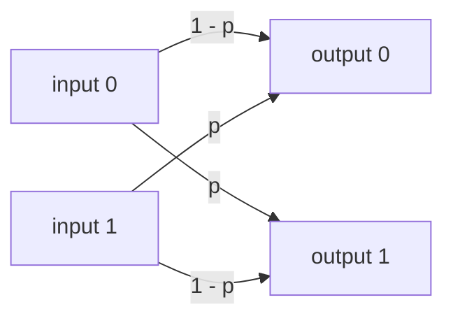
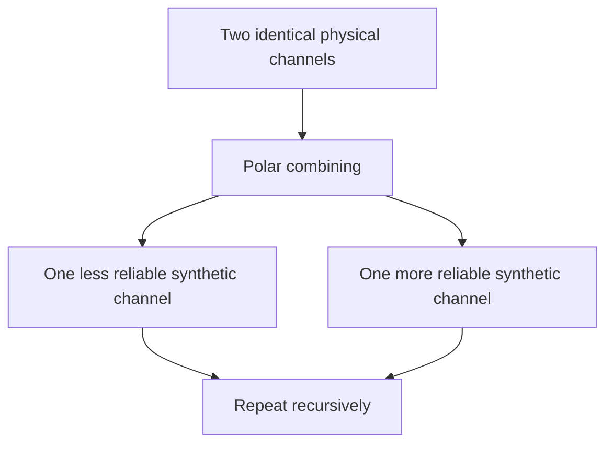

# Intuition Behind Polar Codes

[Back to Home](index.md) | [Next: Mathematical Foundations](02-mathematical-foundations.md)

## Channel Coding in Plain Language

Communication systems send information through imperfect media: air, cable, optical fiber, storage devices, or any mechanism where a transmitted symbol may be corrupted. **Channel coding** adds controlled redundancy before transmission so the receiver can detect or correct errors.

Suppose Alice wants to send one bit:

- `0` means "no";
- `1` means "yes".

If the channel flips the bit sometimes, Bob may receive the wrong answer. A simple repetition code sends the same bit three times:

- send `000` for `0`;
- send `111` for `1`.

If Bob receives `101`, he can use majority vote and guess `1`.

This is channel coding in miniature: use extra symbols to make messages robust.

> **Key idea:** Error correction does not remove noise from the channel. It structures the transmitted data so the receiver can infer the most likely original message.

## Noisy Channels

A **channel** is a probabilistic model of how inputs become outputs. In a binary symmetric channel, a transmitted bit is flipped with probability \(p\):

Other channels output real-valued observations. For example, with BPSK over AWGN:

- bit `0` is mapped to \(+1\);
- bit `1` is mapped to \(-1\);
- Gaussian noise is added.

The receiver sees a real number and must decide which bit was more likely.

## Channel Capacity

The **capacity** of a channel is the maximum reliable information rate. If a channel has capacity \(C\), then, roughly:

- rates below \(C\) can be made reliable with good codes and long enough blocks;
- rates above \(C\) cannot be made arbitrarily reliable.

Capacity is not a decoding algorithm. It is a theoretical limit.

> **Common confusion:** Capacity is about the best possible coding strategy in the limit. It does not say that a particular short code at a particular signal-to-noise ratio will succeed.

## The Big Idea of Polarization

Polar codes begin with many identical uses of a physical channel. Each use has the same reliability. The polar transform recursively combines these channel uses so that the receiver effectively sees a new collection of synthetic channels.

These synthetic channels are not physically separate wires. They are mathematical subchannels experienced by individual input bits after considering the code structure and the decoding order.

As block length grows:

- some synthetic channels become almost perfectly reliable;
- some become almost completely unreliable;
- the fraction of reliable channels approaches the channel capacity.

This phenomenon is **channel polarization**.

> **Key idea:** Polarization turns "many medium channels" into "some very good channels plus some very bad channels."

## A Simple Analogy

Imagine several students answering questions after studying together. At first, each student is moderately reliable. Now suppose the students are arranged into a recursive tutoring system:

- some students receive extra clarifying information from earlier answers;
- other students must answer while carrying more uncertainty.

Over many rounds, the differences become extreme: some answer positions become very trustworthy, others become unreliable.

Where the analogy stops: polar codes do not involve learning or tutoring. The reliability split comes from a precise binary transform and probabilistic conditioning in the decoder.

## Frozen Bits and Information Bits

Once we know which synthetic channels are reliable, we use them for the actual message. These positions are called **information-bit positions**.

The unreliable positions are filled with known fixed values, usually zero. These are **frozen-bit positions**.

Let:

- \(N\) be the block length;
- \(K\) be the number of information bits;
- \(u = (u_0, u_1, \dots, u_{N-1})\) be the input vector to the polar transform;
- \(x = (x_0, x_1, \dots, x_{N-1})\) be the encoded vector transmitted through the physical channel.

The vector \(u\) contains both information bits and frozen bits. The vector \(x\) is the codeword produced after encoding.

> **Common confusion:** The message bits are not sent directly as \(x\). They are inserted into selected positions of \(u\), then transformed into the transmitted codeword \(x\).

## Why Reliability Splits

Polarization starts from a small transformation on two bits. For two input bits \(u_0, u_1\), the encoder forms:

\[
x_0 = u_0 \oplus u_1,\qquad x_1 = u_1
\]

where \(\oplus\) means XOR, or addition modulo 2.

The decoder estimates \(u_0\) first and \(u_1\) second. Estimating \(u_0\) is harder because it depends on both channel observations without knowing \(u_1\). Estimating \(u_1\) becomes easier because the decoder can use its previous decision for \(u_0\). One synthetic channel gets worse, the other gets better.

Repeating this operation recursively produces a stronger split.

## Short Summary

Polar codes work by creating synthetic bit-channels of unequal reliability. The encoder puts message bits in reliable positions and frozen known bits in unreliable positions. The decoder exploits the recursive structure and the known frozen bits to recover the message.

> **Check your understanding:** Why is it useful to freeze the bad synthetic channels instead of trying to send information through all positions?
