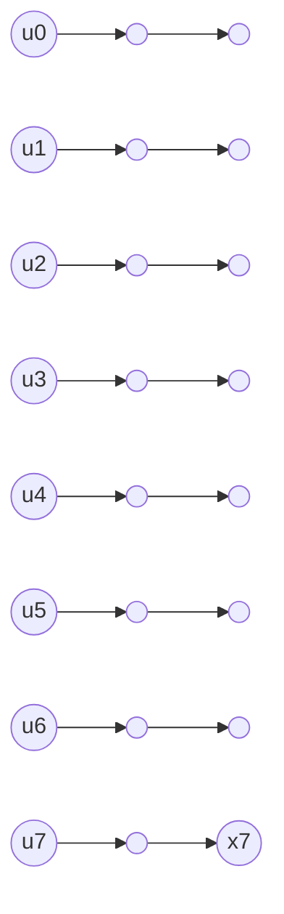

# Polar Encoding

[Previous: Mathematical Foundations](02-mathematical-foundations.md) | [Next: Channel Construction](04-channel-construction.md)

Polar encoding turns an \(N\)-length input vector \(u\) into an \(N\)-length transmitted codeword \(x\). The important point is that \(u\) is not just the message. It contains both message bits and frozen bits.

## Constructing the Vector \(u\)

Choose:

- \(N = 2^n\), the code length;
- \(K\), the number of information bits;
- \(\mathcal{A}\), the set of \(K\) information-bit positions;
- \(\mathcal{F}\), the set of \(N-K\) frozen-bit positions.

The two sets partition all positions:

\[
\mathcal{A} \cup \mathcal{F} = \{0,1,\dots,N-1\},\qquad \mathcal{A} \cap \mathcal{F} = \emptyset
\]

To build \(u\):

1. Put the \(K\) message bits into positions in \(\mathcal{A}\).
2. Put known frozen values, usually zero, into positions in \(\mathcal{F}\).

> **Common confusion:** Frozen bits are not parity bits computed from the message. They are fixed known values placed in unreliable synthetic channels.

## Encoding Rule

The polar generator matrix is:

\[
G_N = F^{\otimes n}
\]

where:

\[
F =
\begin{bmatrix}
1 & 0 \\
1 & 1
\end{bmatrix}
\]

The codeword is:

\[
x = uG_N
\]

All arithmetic is modulo 2.

## Butterfly-Style Implementation

Directly multiplying by \(G_N\) works for tiny examples, but it is inefficient for large \(N\). The recursive structure allows an in-place XOR network with complexity:

\[
O(N\log N)
\]

The transform repeatedly combines pairs of entries separated by a stage-dependent distance.

For \(N=8\), the pattern looks like:



The diagram is intentionally schematic: a real implementation uses stages of XOR operations. The key is that the transform is not arbitrary matrix multiplication; it is a structured butterfly.

## Encoder Pseudocode

The following pseudocode assumes zero-based indexing and a common in-place transform convention. Different libraries may use bit-reversed ordering, so always verify against a small known example.

```text
function polar_encode(u):
    # u is an array of N bits, where N is a power of 2
    x = copy(u)
    N = length(x)
    stage_size = 1

    while stage_size < N:
        block_size = 2 * stage_size
        for block_start from 0 to N-1 step block_size:
            for j from 0 to stage_size-1:
                left = block_start + j
                right = left + stage_size
                x[left] = x[left] XOR x[right]
        stage_size = block_size

    return x
```

For \(N=4\), this computes:

```text
start: [u0, u1, u2, u3]
stage 1: [u0 xor u1, u1, u2 xor u3, u3]
stage 2: [u0 xor u1 xor u2 xor u3, u1 xor u3, u2 xor u3, u3]
```

which matches \(x = uG_4\) for the matrix convention used in this wiki.

> **Implementation warning:** Encoder conventions vary. Some include a bit-reversal permutation, often written \(B_NF^{\otimes n}\), while others use \(F^{\otimes n}\) directly. Your encoder, decoder, frozen-set construction, and test vectors must use the same convention.

## Complexity

There are \(\log_2 N\) stages. Each stage performs \(N/2\) XOR operations. Therefore the total number of XOR operations is:

\[
\frac{N}{2}\log_2 N
\]

This is why polar encoding is efficient even for large block lengths.

## Short Summary

Polar encoding places information bits and frozen bits into \(u\), then computes \(x=uG_N\) using modulo-2 arithmetic. In practice, the recursive structure gives a fast \(O(N\log N)\) XOR implementation.

> **Check your understanding:** Why does the encoder need to know the frozen-bit positions even though frozen bits are usually zero?

