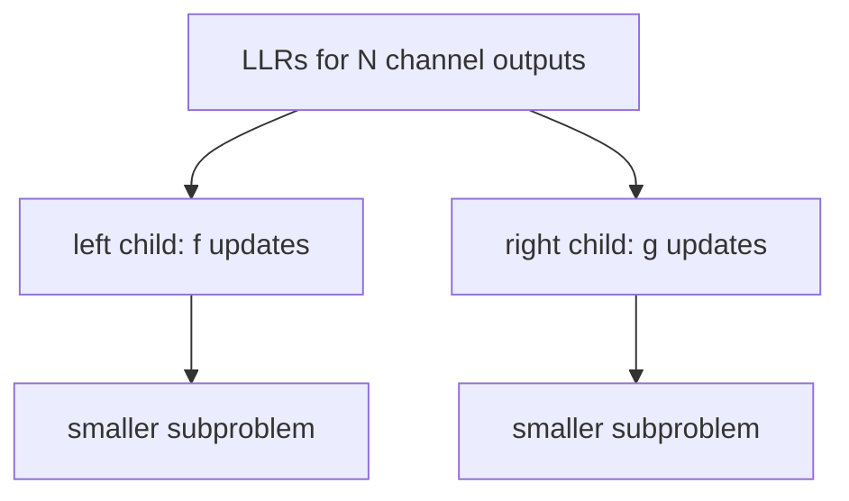

# Successive Cancellation Decoding

[Previous: Channel Construction](04-channel-construction.md) | [Next: SCL and CRC-Aided Decoding](06-decoding-scl.md)

Successive cancellation, or **SC**, is the original polar decoding algorithm. It estimates the bits of \(u\) one at a time, using previous decisions to help later decisions.

## Decoding One Bit at a Time

The receiver observes channel outputs \(y\) produced from the transmitted codeword \(x\). The decoder wants to estimate:

\[
\hat{u} = (\hat{u}_0,\hat{u}_1,\dots,\hat{u}_{N-1})
\]

The SC decoder processes positions in order:

```text
for i = 0 to N-1:
    if i is frozen:
        set u_hat[i] = known frozen value
    else:
        compute likelihood for u_i
        choose the more likely bit
```

The word "cancellation" refers to using earlier decisions to simplify later likelihood calculations.

## Frozen-Bit Decisions

If position \(i\) is frozen, the decoder does not need to infer it from the channel. It simply sets:

\[
\hat{u}_i = 0
\]

or whatever frozen value the code design specifies.

> **Key idea:** Frozen bits act like anchors during decoding. They reduce uncertainty because the decoder already knows their values.

## Information-Bit Decisions

If position \(i\) is an information position, the decoder computes which value, 0 or 1, is more likely given:

- the received channel observations;
- the known frozen-bit values;
- the previous decisions \(\hat{u}_0,\dots,\hat{u}_{i-1}\);
- the polar transform structure.

## Likelihoods and LLRs

For binary decisions, it is common to use a **log-likelihood ratio**:

\[
L = \log \frac{P(y \mid b=0)}{P(y \mid b=1)}
\]

where:

- \(y\) is the relevant received information;
- \(b\) is the bit being estimated.

If \(L > 0\), bit 0 is more likely. If \(L < 0\), bit 1 is more likely.

The hard decision rule is:

\[
\hat{b} =
\begin{cases}
0, & L \ge 0 \\
1, & L < 0
\end{cases}
\]

> **Implementation warning:** Some software uses the opposite BPSK mapping or LLR definition. Always verify whether positive LLR means "0 is likely" or "1 is likely."

## Recursive Decoding Tree

The SC decoder uses the recursive structure of \(G_N\). At each node, it combines LLRs using two update functions usually called \(f\) and \(g\).



The left branch estimates the first half of a subvector. The right branch uses decisions from the left branch.

## The \(f\) and \(g\) Update Functions

Given two LLRs \(a\) and \(b\), the exact \(f\) operation is:

\[
f(a,b) =
2\tanh^{-1}\left(\tanh(a/2)\tanh(b/2)\right)
\]

A widely used min-sum approximation is:

\[
f(a,b) \approx \operatorname{sign}(a)\operatorname{sign}(b)\min(|a|,|b|)
\]

The \(g\) operation uses a previous partial decision \(\hat{u}\):

\[
g(a,b,\hat{u}) = b + (1 - 2\hat{u})a
\]

So:

- if \(\hat{u}=0\), \(g(a,b,0)=b+a\);
- if \(\hat{u}=1\), \(g(a,b,1)=b-a\).

> **Common confusion:** The \(f\) and \(g\) functions operate on reliability information, not directly on transmitted bits.

## Basic SC Decoder Pseudocode

This high-level pseudocode emphasizes the recursive idea. Production decoders often use iterative schedules and memory-optimized arrays.

```text
function sc_decode(llr, frozen_set):
    N = length(llr)
    u_hat = array of N zeros
    decode_node(llr, offset = 0, length = N)
    return u_hat

function decode_node(alpha, offset, length):
    if length == 1:
        i = offset
        if i in frozen_set:
            u_hat[i] = 0
        else:
            if alpha[0] >= 0:
                u_hat[i] = 0
            else:
                u_hat[i] = 1
        return [u_hat[i]]

    half = length / 2

    left_alpha = array of half values
    for j from 0 to half-1:
        left_alpha[j] = f(alpha[j], alpha[j + half])

    left_beta = decode_node(left_alpha, offset, half)

    right_alpha = array of half values
    for j from 0 to half-1:
        right_alpha[j] = g(alpha[j], alpha[j + half], left_beta[j])

    right_beta = decode_node(right_alpha, offset + half, half)

    beta = array of length values
    for j from 0 to half-1:
        beta[j] = left_beta[j] XOR right_beta[j]
        beta[j + half] = right_beta[j]

    return beta
```

The returned `beta` values are partial sums used by parent nodes in the decoding tree.

## Strengths and Weaknesses

SC decoding is attractive because:

- it has low complexity, \(O(N\log N)\);
- it follows the polar code structure naturally;
- it is conceptually clean.

Its main weakness is that early wrong decisions can propagate. Because it commits to one path, it may not recover from a bad early hard decision.

## Short Summary

SC decoding estimates \(u\) bit by bit. Frozen positions are set to known values; information positions are decided from LLRs. Recursive \(f\) and \(g\) updates compute synthetic-channel reliabilities. SC is elegant and efficient, but vulnerable to early decision errors.

> **Check your understanding:** Why can a wrong early SC decision harm later decisions?

