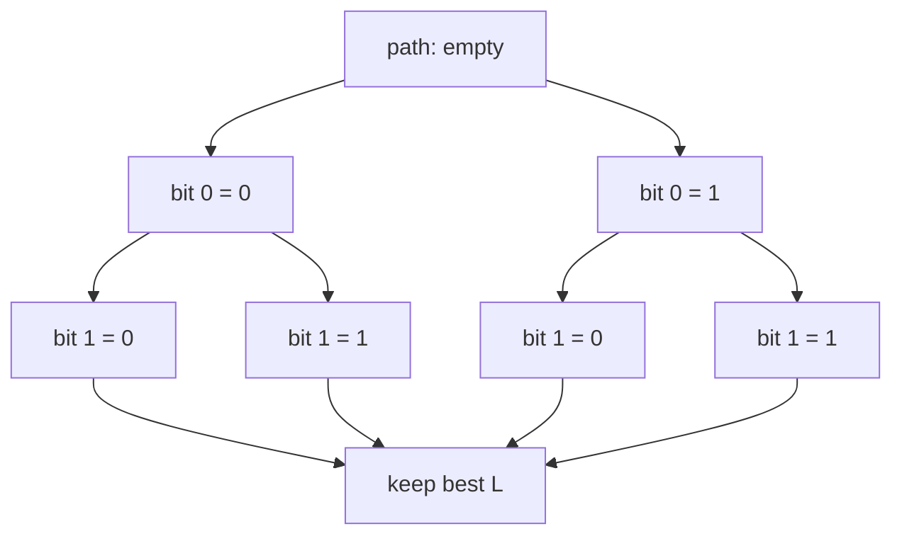

# List and CRC-Aided Decoding

[Previous: SC Decoding](05-decoding-sc.md) | [Next: Implementation Guide](07-implementation-guide.md)

Successive cancellation list decoding, or **SCL**, improves on SC decoding by keeping several candidate decoding paths instead of committing to only one.

## Limitations of SC Decoding

SC decoding makes a single hard decision at each information-bit position. If it chooses the wrong value early, later decisions are made under a false assumption.

SCL decoding addresses this by saying: "When uncertain, keep both possibilities for now."

> **Key idea:** SC follows one path through the decision tree. SCL follows up to \(L\) promising paths.

## Successive Cancellation List Decoding

At each bit position:

- if the bit is frozen, every active path appends the frozen value;
- if the bit is an information bit, each active path splits into two candidates, one with bit 0 and one with bit 1;
- if too many paths exist, keep only the best \(L\) according to a path metric.

The list size \(L\) controls the tradeoff:

- \(L=1\) reduces to ordinary SC decoding;
- larger \(L\) improves performance but increases memory and computation.

## Path Metrics

A **path metric** measures how plausible a candidate path is. Lower metric usually means more likely, although conventions differ.

For an LLR \(\lambda\) and candidate bit \(b\), a common metric increment is based on whether \(b\) agrees with the hard decision implied by \(\lambda\). A simple conceptual version is:

```text
if b is the likely bit:
    penalty is small
else:
    penalty is large, depending on |LLR|
```

The exact formula varies by implementation, numerical domain, and approximation.

> **Implementation warning:** Path metric conventions differ. When comparing results across papers or codebases, check whether metrics are minimized or maximized and how LLRs are clipped.

## Pruning

Without pruning, the number of paths doubles at each information bit:

\[
1,2,4,8,\dots,2^K
\]

This is impossible for large \(K\). SCL keeps only the best \(L\) paths after each split.



## Small Conceptual Example

Suppose \(L=2\), and the decoder reaches an information bit with one active path:

| Path | Candidate bit | Metric |
| --- | --- | ---: |
| A | 0 | 0.2 |
| A | 1 | 1.7 |

Both are kept because the list can hold two paths.

At the next information bit, each path splits:

| Path | Candidate extension | New metric |
| --- | --- | ---: |
| A0 | 0 | 0.5 |
| A0 | 1 | 2.0 |
| A1 | 0 | 2.1 |
| A1 | 1 | 1.9 |

With \(L=2\), only the two best remain:

| Kept path | Metric |
| --- | ---: |
| A0 then 0 | 0.5 |
| A1 then 1 | 1.9 |

The decoder has not committed to one sequence until the end.

## CRC-Aided SCL Decoding

A **cyclic redundancy check**, or CRC, adds a small number of check bits to the information payload before polar encoding. At the decoder:

1. SCL produces a list of candidate messages.
2. The decoder tests each candidate against the CRC.
3. It selects the most likely candidate that passes the CRC.

If no candidate passes, the decoder usually chooses the best-metric candidate or declares a failure, depending on the system.

## Why CRC Helps

SCL often keeps the correct message somewhere in the list, even when it is not the best by metric alone. The CRC gives the decoder an extra way to identify the valid message.

In practical short-block regimes, CRC-aided SCL can dramatically improve polar-code performance.

> **Common confusion:** A CRC is not a replacement for the polar code. It is an additional check that helps choose among candidate decoded messages.

## Complexity and Practical Tradeoffs

Compared with SC, SCL requires:

- more memory for multiple paths;
- more metric computations;
- more sorting or pruning logic;
- careful handling of path copies.

Hardware decoders often use clever memory sharing and approximate metrics to reduce cost.

## Short Summary

SCL decoding improves SC decoding by maintaining up to \(L\) candidate paths. CRC-aided SCL adds a CRC so the decoder can select a valid candidate from the final list. This combination is central to practical polar-code performance.

> **Check your understanding:** Why does increasing \(L\) usually improve performance but also increase implementation cost?

