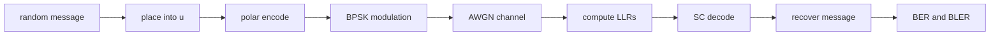

# Implementation Guide

[Previous: SCL and CRC-Aided Decoding](06-decoding-scl.md) | [Next: Polar Codes in 5G](08-polar-codes-in-5g.md)

This page gives a practical recipe for building a simple polar-code simulation. The target is not a production 5G implementation. The target is a clean learning simulator.

## Simulation Pipeline



## Step 1: Choose \(N\) and \(K\)

Pick a small power-of-two block length first:

- \(N=8\) for debugging;
- \(N=32\) or \(N=64\) for early experiments;
- larger \(N\) after tests pass.

Choose \(K\), the number of information bits. The rate is:

\[
R = \frac{K}{N}
\]

For example, \(N=64\), \(K=32\) gives rate \(1/2\).

## Step 2: Select Frozen Positions

For learning, you can start with a precomputed reliability order or a simple construction method. The best \(K\) positions become the information set \(\mathcal{A}\); the rest are frozen.

Keep one convention and write it down:

- Are positions zero-based or one-based?
- Is index 0 the leftmost bit?
- Is there a bit-reversal permutation?
- Is the reliability list ordered best-to-worst or worst-to-best?

> **Implementation warning:** Most polar-code bugs are indexing bugs wearing a clever disguise.

## Step 3: Generate Random Messages

Generate a random binary vector:

\[
m = (m_0,m_1,\dots,m_{K-1})
\]

Each \(m_i\) is 0 or 1 with equal probability.

## Step 4: Build \(u\)

Initialize:

\[
u = (0,0,\dots,0)
\]

Then insert message bits into information positions:

```text
message_index = 0
for i from 0 to N-1:
    if i is in information_set:
        u[i] = message[message_index]
        message_index = message_index + 1
    else:
        u[i] = 0
```

## Step 5: Encode

Use the XOR butterfly encoder from [03-encoding.md](03-encoding.md):

```text
x = polar_encode(u)
```

The result \(x\) is a length-\(N\) binary codeword.

## Step 6: BPSK Modulation

Map bits to real channel symbols. A common convention is:

\[
0 \mapsto +1,\qquad 1 \mapsto -1
\]

In code:

```text
s[i] = 1 - 2*x[i]
```

## Step 7: AWGN Channel

The additive white Gaussian noise channel is:

\[
y_i = s_i + n_i
\]

where \(n_i\) is Gaussian noise with mean 0 and variance \(\sigma^2\).

For a learning simulator, choose \(\sigma\) from your desired SNR convention and document it carefully. SNR, \(E_b/N_0\), and \(E_s/N_0\) are easy to mix up.

## Step 8: LLR Computation

For BPSK with \(0\mapsto +1\), \(1\mapsto -1\), and AWGN variance \(\sigma^2\), the channel LLR is:

\[
L_i = \log \frac{P(y_i \mid x_i=0)}{P(y_i \mid x_i=1)} = \frac{2y_i}{\sigma^2}
\]

Positive \(L_i\) means bit 0 is more likely; negative \(L_i\) means bit 1 is more likely.

> **Implementation warning:** If you use \(0\mapsto -1\) and \(1\mapsto +1\), the LLR sign flips.

## Step 9: SC Decode

Call the SC decoder with:

- the channel LLR vector;
- the frozen set;
- the same indexing convention used by the encoder.

The decoder returns \(\hat{u}\). Extract the estimated message bits from information positions:

```text
message_hat = []
for i from 0 to N-1:
    if i is in information_set:
        append u_hat[i] to message_hat
```

## Step 10: Measure BER and BLER

**Bit error rate (BER)** counts wrong information bits:

\[
\text{BER} = \frac{\text{number of wrong decoded message bits}}{\text{number of transmitted message bits}}
\]

**Block error rate (BLER)** counts wrong message blocks:

\[
\text{BLER} = \frac{\text{number of message blocks decoded incorrectly}}{\text{number of transmitted blocks}}
\]

> **Common confusion:** BER and BLER measure different things. A block with one wrong bit and a block with many wrong bits both count as one block error.

## Clean End-to-End Pseudocode

```text
function simulate_polar(N, K, information_set, snr_values, frames_per_snr):
    frozen_set = all positions not in information_set

    for snr in snr_values:
        bit_errors = 0
        block_errors = 0
        total_bits = 0
        total_blocks = 0

        sigma2 = noise_variance_from_snr(snr, rate = K/N)

        for frame from 1 to frames_per_snr:
            message = random_bits(K)

            u = zeros(N)
            j = 0
            for i from 0 to N-1:
                if i in information_set:
                    u[i] = message[j]
                    j = j + 1

            x = polar_encode(u)

            for i from 0 to N-1:
                s[i] = 1 - 2*x[i]
                y[i] = s[i] + gaussian_noise(mean = 0, variance = sigma2)
                llr[i] = 2*y[i] / sigma2

            u_hat = sc_decode(llr, frozen_set)

            message_hat = extract positions information_set from u_hat

            errors = count_positions_where(message_hat != message)
            bit_errors = bit_errors + errors
            if errors > 0:
                block_errors = block_errors + 1

            total_bits = total_bits + K
            total_blocks = total_blocks + 1

        BER[snr] = bit_errors / total_bits
        BLER[snr] = block_errors / total_blocks

    return BER, BLER
```

## Common Mistakes

- Using normal addition instead of XOR or modulo-2 addition.
- Mixing zero-based and one-based frozen-bit indices.
- Using a frozen set built for a different bit-order convention.
- Applying bit reversal in the encoder but not in the decoder.
- Using the wrong LLR sign convention.
- Forgetting that encoder and decoder need exactly the same frozen set.
- Comparing decoded \(u\) against transmitted \(x\) instead of comparing extracted information bits against the message.
- Simulating too few frames at high SNR and trusting a noisy BER estimate.

## Debugging Strategy

Start without noise. Set \(y\) so the channel LLRs strongly favor the transmitted codeword. The decoder should recover the message perfectly.

Then test:

1. \(N=4\) against a hand calculation.
2. \(N=8\) with known frozen positions.
3. noiseless decoding over many random messages.
4. noisy decoding at very high SNR.
5. BER and BLER curves over several SNR values.

> **Check your understanding:** Why is noiseless decoding a useful test even though real channels are noisy?

## Short Summary

A simple polar-code simulator consists of message generation, frozen-bit insertion, XOR-based encoding, BPSK modulation, AWGN noise, LLR computation, SC decoding, and BER/BLER measurement. Most failures come from indexing, bit ordering, or sign conventions.

